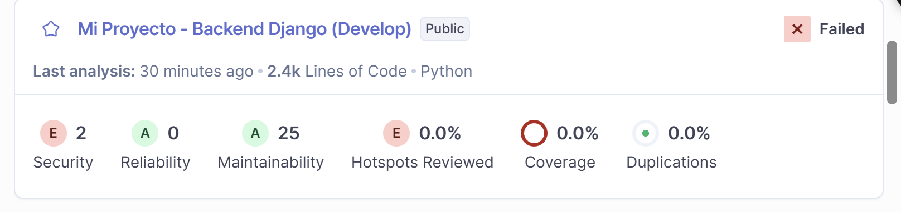
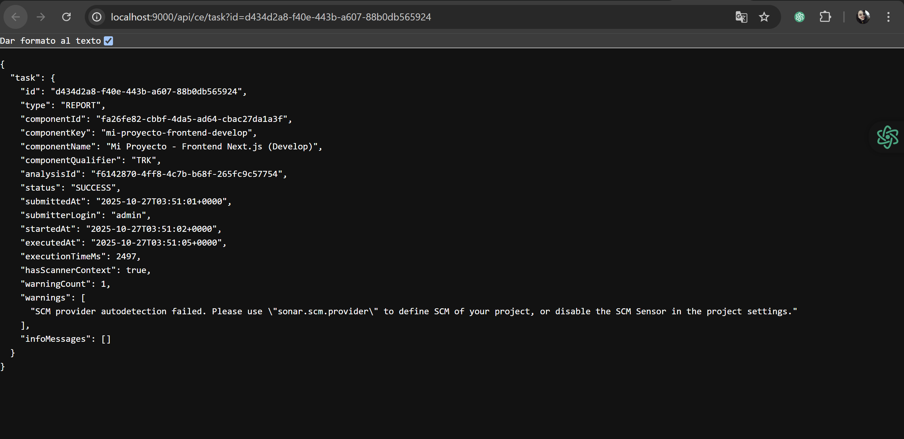
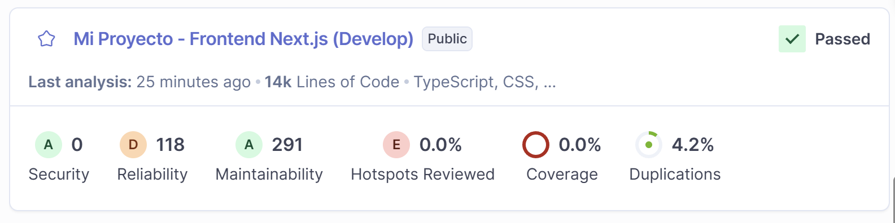

# Code Quality Analysis with SonarQube 

## Backend Results (Django)

- **Project**: mi-proyecto-backend-develop
- **Status**: SUCCESS
- **Files Analyzed**: 98 Python files
- **Analysis Time**: 1 minute 38 seconds
- **URL**: http://localhost:9000/dashboard?id=mi-proyecto-backend-develop

## Key Backend Findings:
- **Security**: 2 Open Issues (E)
- **Security Hotspots**: 18 Open Issues (E)
- **Maintainability**: 25 Open Issues (A)
- **Reliability**: 0 Open Issues (A)
- **Duplications**: 0.0%

## Frontend Results (Next.js)  

- **Project**: mi-proyecto-frontend-develop
- **Status**: SUCCESS
- **Files Analyzed**: 71 TypeScript + 62 CSS files
- **Analysis Time**: 1 minute 19 seconds
- **URL**: http://localhost:9000/dashboard?id=mi-proyecto-frontend-develop

## Key Frontend Findings:
- **Security**: 0 Open Issues (A)
- **Security Hotspots**: 9 Open Issues (E)
- **Maintainability**: 291 Open Issues (A)
- **Reliability**: 118 Open Issues (D)
- **Duplications**: 4.2%
